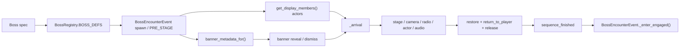

# 演出编排方法论（Cinematic Authoring）

> 给"下一段演出"和"下一个 BOSS"的作者看的。本文是**方法论、BOSS 登场量产流程与陷阱清单**，数值权威在
> [specs/systems/ui-transition.md](../specs/systems/ui-transition.md)。
> 每一条都来自 Wraith 登场演出（2026-07-20~21）实际踩过的坑 —— 共 15+ 个，
> 其中约一半是无头测试全绿、进引擎才炸的。

## 0. 三权分立（先想清楚谁管什么）

| 权 | 归属 | 铁律 |
|---|---|---|
| 视觉（镜头/时间/遮罩/尾迹/透明度） | 表演导演 | 随便折腾，但 release 必须**全部复原** |
| 台词 | 演出编排内容与时机；**渲染仍走 RadioChatter 显示带** | 发射后不管，不得依赖出声准点 |
| AI/玩法状态 | **只经 GameEvent.set_directive 借用** | 导演不持有指令；演出结束重建事件自己的阶段契约 |

**核心教训（隐身事件）**：演出想要某个玩法机制的"样子"时，**只借它的视觉语言，
不要动它的状态机**。真隐身状态机在 PRE_STAGE 下休眠、计时器不倒数 → 一置位就是永久隐身。
演出效果的生命周期必须 ≤ 演出本身；凡是"演出结束后还生效"的状态，都要问一句：
**谁负责把它关掉？答不出来就不许开。**

## 1. 开工前四问（每问漏一个都出过事故）

1. **空间尺度从速度反推了吗？** `PIXELS_PER_METER = 0.5`：1600 km/h ≈ 222 px/s。
   所有距离 = 速度 × 可见秒数，先算再写。历史事故：5200px 进场段需 41 秒，演出结束时飞机还在画面外；
   交汇几何一度要求 6 马赫。
2. **暂停语义三查**：演出全程 `hard_pause`，逐个确认——
   - 每个要动的系统**谁在泵**？（镜头应用在 survivor_mode._process → 暂停即死，导演须代泵）
   - 每个要动的节点 `process_mode` 是什么？（RadioChatter 没设 ALWAYS → 台词全部积压到演出后）
   - 用哪个时钟？`_process` 的 delta 被 time_scale 缩放（需 unscaled 还原）；
     `_physics_process` 的 delta 是**固定步长**（缩的是 tick 频率，**不许**除 time_scale，
     否则事件计时比世界物理跑得快）。
3. **每个参数有消费方吗？** 往 `directive.params` 里塞值 ≠ 生效。交汇的逐机反解速度写进了
   JSON、写进了 spec、写了断言 —— 但 `_directive_follow_path_step` 根本不读它，
   断言只验了数据不验消费链。**新参数落地 = 写入方 + 消费方 + 一条穿透两端的验证。**
4. **命名契约核对了吗？** 派生名（如 `boss_id.to_lower() + "_arrival"`）对不上就**静默回落**，
   不报错 —— 症状是"只有无线电、镜头不动"。已有断言 `arrival.*` 双向校验，新演出照抄。

## 2. 引擎陷阱速查（都是本项目真踩过的）

| 陷阱 | 后果 | 对策 |
|---|---|---|
| CanvasLayer **没有 `modulate`** | 运行时报错中断循环，HUD 藏不掉 | `StageIsolator._set_alpha`：CanvasLayer 走 `visible` |
| Container 每帧覆写子节点 `position/size` | 位移动画被吃掉 | 只动 `scale` + `modulate`；先设 `pivot_offset` |
| `self_modulate` 不向子节点传播 | （反向好消息）机体隐身不会带走尾迹 | 机体淡出用 `self_modulate`，全灭用 `modulate` |
| 传送飞机后尾迹丝带连出巨线 | "出生点→演出起点"横贯地图 | 传送后 `clear_trail()` |
| heading 约定：0=北、方向 d 的 heading = `d.angle()+PI/2` | 方向差 180° 开场就地掉头 | 用**行进方向**（不是进场轴）算 heading |
| 无类型数组字面量转不成 `Array[Control]` | 运行时报错后**静默走兜底** | 显式构造 typed array |
| `visible = true` 早于压 alpha | 等布局那帧全不透明闪现 | 先压 alpha 0 → visible → 等帧 → pivot |
| 错开动画 `dur` 当单元素时长 | 最后一个元素永久停在半透明 | `dur ≥ elem_dur + stagger×(n−1)`，断言守门 |
| 压暗层高度写死 | 战术图（layer 15）被自己的遮罩盖黑 | `min(DIM_LAYER, panel.layer − 1)` |
| 状态记账早退（`if _paused == on: return`） | 外部直写 tree.paused 后解除变 no-op | 幂等写入，以引擎实际状态为准 |
| 离屏 LOD 把远端敌机 `visible=false`，而 LOD 扫描在演出暂停期不跑 | 演员 alpha 全对却**全场隐形**（尾迹可见、机体不见） | `_set_actor_awake`：唤醒即 `visible=true + lod_level=0` |
| 散开方向均布 → 必有一架朝玩家 | 贴脸误触 ENGAGED，engage 摆位当场瞬移 | 散开取**背向玩家的扇面**（`fan_deg`） |
| 高速 = 巨转弯半径（2400 km/h ≈ 2500px 半径） | "汇聚成一点"物理上切不进去 | 收紧编队 + 拉长窗口把反解速度压回巡航量级；交汇触发半径必须 **< 编队最小间距** |
| `crossfade_music` 无同曲早退 | 演出切过 BOSS 曲后，交战切歌点把同一首**重启** | 用 `AudioManager.current_music_id()` 幂等守卫再切 |

## 3. 镜头方法论

- **跟主体，不看地点。** `cut_to` 定点看锚点 = 盯着空气；正确做法是 `follow=true` 咬住长机
  （`cine_target` + 暂停期 `cine_follow_tick` 代泵），手感对齐空格跟随。
- 步骤顺序：**先传送演员、再切镜**（同 `at` 靠数组序执行，切镜要读演员定位）。
- 归位（`return_to_player`）一开始就清 `cine_target` —— 别追着隐身/散开的目标跑。
- zoom 全走 `cine_zoom_mult`（乘法叠加层），绝不直改 `camera.zoom`（回读反馈环会自乘发散）。

## 4. 收尾契约（泄漏是最高危故障面）

release / 超时 / clear_all 三条路径都必须复原全部四类状态，且**幂等**：

1. 时间（栈清空 + 解除暂停）→ 泄漏 = 卡 0.05 倍速
2. 舞台（全场 alpha 拉回，**重扫而非快照**——中途有单位生灭）→ 泄漏 = 世界隐形
3. 演员（指令经 owner 清 + 尾迹参数还原 + 演出视觉状态复位）→ 泄漏 = BOSS 永不参战 / 永久隐身
4. 事件阶段契约（PRE_STAGE 需重下巡逻指令 + 补持久提示）→ 漏掉 = 状态机停摆、AI 乱飞

## 5. 验证阶梯（各层能抓什么、抓不了什么）

| 层 | 能抓 | 抓不了 |
|---|---|---|
| 无头断言（`--bench=presentation`） | 数值/时序/配平/命名契约/几何包线 | 一切引擎交互 |
| SceneTree 探针（临时脚本真跑 present/dismiss） | 暂停语义、typed array、首帧闪现、泄漏 | 视觉观感、多系统合流 |
| 引擎内肉眼（主菜单 BOSS DEBUG → 选择 BOSS） | 层叠遮挡、镜头手感、节奏、"到底好不好看" | —— |

**规律：本次 15+ 个 bug 里，凡是"暂停下谁在跑"“属性存不存在”“方向对不对"这类引擎事实，
无头层全部漏过。** 所以新演出**必须**走完第三层才算完成，前两层绿≠能玩。

## 6. 序列文法（sequences.json）

一段演出 = 一个顶层键 + `steps` 数组。`Presentation.reload_sequences()` 负责重读 JSON，
`Presentation.debug_replay("名字")` 可反复重放。导演保留 F8 调试入口，但 Godot 编辑器会优先把 F8
解释为“停止运行”，Boss Debug 也占用 F8 复活/重抽；正式 authoring 不依赖该快捷键，保存后从
主菜单 BOSS DEBUG 重进目标 BOSS，或由明确的临时调试调用点执行 reload + replay。

```json
"my_cinematic": {
  "max_sec": 7.0,          // 硬超时（可选）：到点强制收尾，防演出卡死锁死一局
  "steps": [ { "at": 0.0, "ch": "通道", "op": "动作", ...参数 }, ... ]
}
```

| 字段 | 语义 |
|---|---|
| `at` | 起始秒（演出内时钟，unscaled —— 不受暂停/时间缩放影响） |
| `dur` | 时长；**缺省 = 瞬时**（只在跨过 `at` 那帧发一次） |
| `ease` | 缓动名（`linear / cubic_in / cubic_out / cubic_in_out / expo_out / back_out`），缺省 linear |
| `from` | 插值起点；**缺省 = 通道当前值**（被打断时从现值续插，不跳变） |

**两条文法铁律**：
- 同一 `at` 的多个 step 按**数组顺序**执行 —— 依赖别人产出的 step 必须排在后面
  （例：`cut_to(follow)` 要读演员传送后的位置，必须排在 `echelon_ingress` 之后）
- 未知 `ch` / `op` → `push_warning` 后跳过，**不中断序列**（热重载写错不会把游戏卡死）

## 7. 通道与动作全参考

### `time` —— 时间（唯一写入口）
| op | 参数 | 说明 |
|---|---|---|
| `request` | `id, to, dur` | 申请时间缩放（栈内最小值获胜；同 id 覆盖不叠加） |
| `release` | `id, dur` | 释放。**必须与 request 的 id 配平**，否则永久慢动作 |
| `pause` | `to`（1/0） | `get_tree().paused` 开/关。演出骨架首尾各一个 |

### `camera` —— 镜头（暂停期由导演代泵）
| op | 参数 | 说明 |
|---|---|---|
| `cut_to` | `zoom, follow, actor` | 瞬切。`follow=true` 咬住 `actors[actor]` 持续跟随（空格跟随手感）；否则定点 ctx.anchor —— **定点几乎总是错的**（§3） |
| `zoom` | `from?, to, dur, ease` | 推近/拉远，乘法系数（1.3 = 推近 30%） |
| `shake` | `to` | 一次抖动（trauma 叠加，自然衰减） |
| `return_to_player` | `dur, ease` | 松开跟随 + 平滑还原玩家 zoom。放在世界淡回同拍 |

### `overlay` —— 全屏遮罩
| op | 参数 | 说明 |
|---|---|---|
| `dim` | `from?, to, dur, ease` | 黑色压暗层（layer 随面板动态取位，演出中在 16） |
| `flash` | `to, dur, ease` | 白色闪光层（layer 25，盖住一切面板） |

### `banner` —— BOSS 系统入侵身份横幅
| op | 参数 | 说明 |
|---|---|---|
| `reveal` | `dur, ease` | 从 `ctx.boss_banner` 读取 `name_key / role_key / motto_key / callsign / palette`；5 个警告窗严格逐个完成压入，最后才展开主身份横幅。正式 arrival 的 `dur=1.05` |
| `dismiss` | `dur, ease` | 故障条与主横幅退出；`camera.cut_to` 必须排在该 step 完成之后。正常/超时/`clear_all()` 都会强制隐藏 |

### `stage` —— 空舞台
| op | 参数 | 说明 |
|---|---|---|
| `clear` | `dur, ease` | 冻世界 + 非演员淡出 + 地图压暗 + HUD 隐藏 + **演员唤醒**（ALWAYS + visible + LOD 满档） |
| `restore` | `dur, ease` | 世界淡回（重扫全场，幂等，自动覆盖演出中生灭的单位） |

### `actor` —— 演员（指令全部经 ctx.owner 下发，真物理，禁 K 帧）
| op | 参数 | 说明 |
|---|---|---|
| `trail_boost` | — | 尾迹 80→240 点 / 8→14 宽（长线交汇的视觉基础）。release 自动还原 |
| `echelon_ingress` | `offsets, ingress_dist, speed, alt_step, stagger, fade, dur` | 编队定位 + 传送（自动清尾迹）+ 逐机错开淡入 + 平飞进场。`offsets` = [[沿进场轴, 横向], ...] 沿 inbound 旋转；`dur = fade + stagger×(n−1)` |
| `converge` | `dur, arrive_radius` | 全员同时抵达 ctx.cp：逐机按距离反解速度（超巡航自动加力，超机体上限报 warning = 几何过大） |
| `cloak_on_meet` | `radius, fade, dur` | **交汇即隐身**：僚机贴上长机（`actors[0]`）即各自淡出，长机随首次交汇淡出，窗口末强制兜底。`radius` 必须 **< 编队最小间距** |
| `cloak_vanish` | `dur, ease` | 备用：定时集体淡出（当前未用）。均为**演出专属视觉**，release 全解除 |
| `scatter` | `fan_deg, dist` | 背向玩家（inbound 方向）的扇面散开，速度归还巡航。**永不朝玩家甩**（误触 ENGAGED） |
| `release` | — | 收尾：清指令 / 还原尾迹 / 解除演出隐身。**每段演出必须有** |

### `radio` —— 台词（渲染走 RadioChatter 显示带）
| op | 参数 | 说明 |
|---|---|---|
| `line` | `key, actor, dur` | 说话人 = `ctx.callsign_prefix + "-%02d" % (actor+1)`。`dur` = 编排时长（**必填**，绕开 ambient 的 2.6s 可读性封底）。发射后不管，演出时序不得依赖出声准点；演出期间 ambient 自动压制 |

### `audio` —— 配乐
| op | 参数 | 说明 |
|---|---|---|
| `boss_bgm` | `fade` | 按 ctx 的 `bgm_layers` / `bgm_track` 切 BOSS 曲。交战侧切歌点有 `current_music_id()` 幂等守卫，不会重启同曲 |

### `panel` —— 面板元素（UI 转场用，演出一般不碰）
`stagger_in / stagger_out`（`stagger, elem_dur, dur, ease`）—— 见 spec §2.3；
面板出入场走 `Presentation.present / dismiss`，不走 `play_cinematic`。

## 8. 从事件触发演出（ctx 契约）

```gdscript
# 必须由一个 GameEvent 发起 —— 它是演员指令的所有权持有者，
# 事件结束时 EventDirector 的 clear_all_directives 是最后一道兜底
var ok: bool = Presentation.play_cinematic("my_cinematic", {
    "owner": self,                    # 必填：GameEvent（无 owner 导演直接拒绝）
    "actors": members,                # 必填：Array[Aircraft]，actors[0] = 长机（镜头/交汇的基准）
    "anchor": anchor,                 # 集结点（cut_to 无 follow 时的定点）
    "cp": anchor + inbound * 250.0,   # 交汇点（converge / scatter 的圆心）
    "inbound": inbound,               # 进场方向 = (anchor - player).normalized()，散开扇面的中轴
    "extra_layers": [地图, hud, ...], # stage 要一起压暗的层（CanvasLayer 自动走 visible）
    "callsign_prefix": "WRAITH",      # radio 说话人前缀
    "boss_banner": BossRegistry.banner_metadata_for(encounter.boss_id), # banner 身份数据
    "bgm_layers": [...], "bgm_track": "boss",   # audio.boss_bgm 的快照
})
if ok:
    # 收尾钩子：重建事件自己的阶段契约（PRE_STAGE 要重下巡逻指令 + 补持久提示）
    pres.sequence_finished.connect(_on_done.bind("my_cinematic"), CONNECT_ONE_SHOT)
```

三条契约：
1. **ctx 的业务数据全是快照**（字符串/坐标/普通数组），导演不认识 encounter。仅 `owner` 与
   `actors` 是受契约约束的活对象引用；不要再把 encounter、mode 或其它业务对象塞进 ctx
2. `play_cinematic` 返回 false（无 owner / 无演员 / 序列不存在）时**必须有回落路径**
   （boss 登场的回落 = 旧横幅+无线电；参考 `_try_play_arrival_cinematic`）
3. `sequence_finished` 在 release 之后发 —— 钩子里做"演出后世界该是什么样"的重建，
   不要做视觉清理（那是导演的活，已经做完了）

## 9. BOSS 登场量产流水线（身份横幅 + 镜头 + 接战）

本节是新增 BOSS 时的**执行手册**；BOSS 的玩法、编成、阶段和数值仍先写入自己的
`docs/specs/bosses/<name>.md`，再按 [playbook §2](playbook.md#2-加-boss) 落主体。登场演出不建立
第二套 BOSS 状态机，它只在 `BossEncounterEvent.PRE_STAGE` 中借用演员、播放表现，清理完毕后把
控制权还给事件并立即进入 `ENGAGED`。



### 9.1 完成定义

一个新 BOSS 的登场只有同时满足下列条件才算完成：

| 契约 | 完成条件 |
|---|---|
| 玩法 | BOSS spec 已 approved；主体可生成，`get_display_members()` 返回有效单位 |
| 身份 | 注册表提供横幅名、角色类型、包装英文、呼号与 palette token；全部玩家可见文本进入五表 i18n |
| 命名 | `boss_id = MY_BOSS` 对应序列名严格为 `my_boss_arrival` |
| 时序 | 先横幅、横幅完全退场后才切镜；镜头归还后才解除暂停并接战 |
| 时长 | 整条不可跳过演出 `max_sec = 7.0`，实际最后一步 `at ≤ 7.0` |
| 收尾 | `stage.restore + camera.return_to_player + time.pause(to=0) + actor.release` 齐全 |
| 退化 | 缺序列、缺演员、UI 覆盖或意外中断均 fail-open 进入 `ENGAGED`，不得卡在 PRE_STAGE |
| 验证 | i18n 构建、`presentation`、`boss_phase`、横幅 Visual、真实 Boss Debug 观看全部完成 |

### 9.2 第一步：注册身份与玩家可见文本

在 `BossRegistry.BOSS_DEFS` 增加完整条目。横幅组件只消费注册表快照，**禁止**在
`BossArrivalBanner` 或 `PresentationDirector` 里按 boss id 写分支。

```gdscript
"MY_BOSS": {
    "class_path": "res://scripts/survivor/my_boss.gd",
    "bgm": "boss_my_boss",
    "display_name": "MY BOSS",                  # 日志/内部回退
    "name_key": "CODEX_MY_BOSS_NAME",           # 结算/图鉴玩家可见名
    "banner_name_key": "BOSS_BANNER_MY_BOSS_NAME",
    "banner_role_key": "BOSS_BANNER_MY_BOSS_ROLE",
    "banner_motto_key": "BOSS_BANNER_MY_BOSS_MOTTO",
    "banner_palette": "terminal_green",
    "callsign_prefix": "MYBOSS",
    "requires_water": false,
}
```

横幅三项身份文本放入 `i18n/gameplay.csv`：

```csv
BOSS_BANNER_MY_BOSS_NAME,中文名,MY BOSS,日本語名
BOSS_BANNER_MY_BOSS_ROLE,中文角色类型,ROLE TYPE,日本語役割
BOSS_BANNER_MY_BOSS_MOTTO,PACKAGING ENGLISH,PACKAGING ENGLISH,PACKAGING ENGLISH
```

- `banner_name_key` 是横幅唯一第一视觉焦点，不等同于 `display_name`，也不要求与图鉴文本完全相同。
- `banner_role_key` 只写角色类型；组件统一拼成 `THREAT CLASS // <ROLE>`。
- `banner_motto_key` 是左上角包装英文；即使三语相同也必须走 i18n key。
- `callsign_prefix` 同时用于横幅 `CALLSIGN //` 和无线电说话人 `<prefix>-01/02/...`。
- 已有 palette token 是 `terminal_green`、`wraith_blue` 与 Black Star 的 `black_star`。只换文案不要新造 palette；确需新色板时，
  同步 `ThemeColors`、`BossArrivalBanner.PALETTES`、`has_palette()` 断言和 Visual QA。

登场台词放 `i18n/radio.csv`，并在 `resources/chatter/radio_chatter.json` 的 `boss_sequences` 登记
`spawn / engage / phase2`。正式镜头序列直接引用同一组 `RADIO_BOSS_<ID>_*` key；`boss_sequences`
仍必须保留，因为演出缺失或启动失败时，旧 WARNING + 无线电路径会消费它。

五表资源统一重建：

```powershell
bench\run.cmd i18n_build 5 180 Shadow
```

构建物在 `bench/results/`。把对应五表的 `zh/en/ja.translation` 复制回 `i18n/`；禁止手改二进制
`.translation`，也不要恢复已废弃的单体 `translations.csv`。完整规则见 [i18n.md](i18n.md)。

### 9.3 第二步：明确演员协议与 PRE_STAGE 摆位

`BossEncounterEvent` 用 `encounter.get_display_members()` 同时取得 HUD 成员和演出演员。量产时先把
演员列表写清楚，再选镜头模板：

| BOSS 类型 | `get_display_members()` | 可直接使用的演出动作 |
|---|---|---|
| 单主体飞机 | `[boss_unit]`，主体必须是 `actors[0]` | camera / stage / radio / audio；需要时可用 Aircraft actor op |
| 海军旗舰 | `[flagship]`，旗舰必须是 `actors[0]` | camera / stage / radio / audio；不要套用飞机编队动作 |
| 多机中队 | 稳定顺序数组，长机必须是 `actors[0]` | 可追加 ingress / trail / converge / cloak / scatter |
| 复合 BOSS | 只返回镜头应展示、HUD 应追踪的核心单位 | 先做主体特写；确需多演员再扩专用 op |

`actors[0]` 是镜头跟随、交汇基准与默认长机，不能依赖场景树顺序临时决定。数组必须过滤已释放对象；
主体生成后到演出开始之间不能返回空数组，否则 `_try_play_arrival_cinematic()` 会走 fail-open。

当前 `BossEncounterEvent._start()` 仍按 encounter 类型负责 spawn 与 PRE_STAGE directive。新增 BOSS 时仅注册
`class_path` **不够**：还要补对应 spawn 分支和 `_apply_pre_stage_directives_<boss>()`，保证演员在横幅期间
已经存在、武器受控、没有提前接战。简单特写可以只让事件持有现有巡逻/待机指令；复杂走位仍由
`CinematicCast` 通过事件的 `set_directive()` 借用控制权。

`CinematicCast.bind()` 到 `release()` 同时是演员的**虚拟环境所有权窗口**：真实战斗传感器隐形在此期间
冻结计时并绕过逻辑、绘制与尾迹门，不能抢走导演的表现控制；分镜需要隐身时只改演员视觉字段。
任何正常结束、超时或 `clear_all` 路径都必须走 `release()` 清除此所有权，之后真实战斗状态继续生效。

### 9.4 第三步：身份横幅固定骨架

身份差异全部来自 `BossRegistry.banner_metadata_for()` 返回的快照：

```text
name_key / role_key / motto_key / callsign / palette
```

正式 arrival 共用以下前导，不为单个 BOSS 改动画节拍：

| 时间 | 固定动作 |
|---|---|
| `0.00s` | hard pause；overlay.dim；`banner.reveal dur=1.05`；BGM 开始 crossfade |
| `0.00–0.72s` | 5 个系统警告窗严格逐个完成压入 |
| `0.72–1.05s` | 主身份横幅与包装英文完成展开 |
| `1.05–1.30s` | 保持完整身份供扫读 |
| `1.30–1.50s` | `banner.dismiss dur=0.20`；同步开始 stage.clear |
| `≥1.50s` | 横幅已完全隐藏，才允许 `camera.cut_to` |

组件已经统一处理文字安全区、父级硬裁切、语言回退和未知 palette 回落。新增 BOSS 只提供数据，
不得复制一套横幅节点或绕过 `banner` 通道直接 show/hide。

### 9.5 第四步：选择镜头模板并写序列

#### 模板 A：单主体特写（默认量产模板）

航母、巨型飞机、地面主体默认从 `carrier_strike_group_arrival` / `mother_goose_arrival` 复制。
它只要求 `actors[0]` 是有效 `CombatUnit`，风险最低：

```json
"my_boss_arrival": {
  "max_sec": 7.0,
  "steps": [
    { "at": 0.0, "ch": "time", "op": "pause", "to": 1 },
    { "at": 0.0, "ch": "overlay", "op": "dim", "to": 0.22, "dur": 0.12, "ease": "cubic_out" },
    { "at": 0.0, "ch": "banner", "op": "reveal", "dur": 1.05, "ease": "back_out" },
    { "at": 0.05, "ch": "audio", "op": "boss_bgm", "fade": 2.0 },
    { "at": 1.3, "ch": "banner", "op": "dismiss", "dur": 0.2, "ease": "cubic_in" },
    { "at": 1.3, "ch": "overlay", "op": "dim", "to": 0.0, "dur": 0.2, "ease": "cubic_in" },
    { "at": 1.3, "ch": "stage", "op": "clear", "dur": 0.45, "ease": "cubic_out" },
    { "at": 1.5, "ch": "camera", "op": "cut_to", "zoom": 0.75, "follow": true, "actor": 0 },
    { "at": 1.9, "ch": "radio", "op": "line", "key": "RADIO_BOSS_MY_BOSS_SPAWN_1", "actor": 0, "dur": 1.5 },
    { "at": 5.6, "ch": "stage", "op": "restore", "dur": 0.7, "ease": "cubic_in_out" },
    { "at": 5.6, "ch": "camera", "op": "return_to_player", "dur": 0.7, "ease": "cubic_in_out" },
    { "at": 6.3, "ch": "time", "op": "pause", "to": 0 },
    { "at": 6.3, "ch": "actor", "op": "release" }
  ]
}
```

调参优先级：先让主体始终在画面中，再调 `zoom`，最后排台词。不要为了塞更多台词延长 7 秒上限；
删句、缩短演出台词 `dur` 或让最后一句覆盖返镜过程。

#### 模板 B：多演员特技（仅有明确分镜时使用）

从 `wraith_squadron_arrival` 复制，并在写 JSON 前完成空间/速度反解。`echelon_ingress`、`converge`、
`cloak_on_meet`、`scatter` 都按 Aircraft 物理和长机语义设计，不能直接用于舰船或地面单位。

新动作只有在现有 op 无法表达时才加入 `cinematic_cast.gd`；新增参数必须同时存在：

1. JSON 写入方；
2. `PresentationDirector` / `CinematicCast` 分发与消费方；
3. 真实对象状态复原；
4. 穿透写入方与消费方的断言；
5. Visual / 引擎内观看证据。

### 9.6 第五步：事件接线与 fail-open

注册表、演员和 `<boss_id 小写>_arrival` 就绪后，通用 `_try_play_arrival_cinematic()` 会自动组装 ctx：

```text
owner / actors / anchor / cp / inbound / extra_layers /
callsign_prefix / boss_banner / bgm_layers / bgm_track
```

不要为新 BOSS 复制一份导演调用。BOSS 专属代码只负责主体 spawn、PRE_STAGE directive 和
`get_display_members()`；横幅、镜头、BGM 与收尾继续走共同入口。

收尾顺序是硬契约：

1. 序列先执行 `stage.restore` 与 `camera.return_to_player`；
2. 最后一拍解除暂停并 `actor.release`；
3. 导演完成所有清理后发 `sequence_finished`；
4. `_on_arrival_cinematic_done()` 调 `_enter_engaged()`，统一打开武器、血条与战斗阶段。

若 arrival 被其它 UI 序列替换，完成信号的名字会与预期不同。此时不能重播或重挂旧 arrival；事件在
仍处于 PRE_STAGE 时必须立即 fail-open 接战，否则会永久没有血条。这个规则已经由 `presentation`
断言守门，新 BOSS 不另写覆盖逻辑。

### 9.7 第六步：回归与视觉验收

先跑机器门：

```powershell
bench\run.cmd i18n_build 5 180 Shadow
bench\run.cmd presentation 1 180 Shadow
bench\run.cmd boss_phase 1 180 Shadow
bench\run.cmd boss_arrival_banner_visual 1 180 Shadow Visual
```

新 BOSS 需要补三类自动证据：

- `test_presentation.gd::_test_boss_banner_contract`：注册字段、palette、i18n、横幅先于镜头、命名双向契约。
- `test_presentation.gd` 的简单/复杂序列断言：`max_sec ≤ 7`、cut/radio/return/release 齐全；复杂演出再验几何包线。
- `boss_arrival_banner_visual_qa_runner.gd`：至少新增一张完整身份截图；新 palette 还要加逐窗阶段截图。

随后从主菜单 BOSS DEBUG 选择新 BOSS，完整看一遍真实演出。人工验收必须逐项确认：

| 阶段 | 看什么 |
|---|---|
| 横幅 | 名称/角色/呼号/motto 正确；无越框；palette 不污染其它 BOSS；5 窗顺序可辨 |
| 切镜 | 横幅消失后才切；主体在画面内；镜头跟随对象正确；无出生点尾迹巨线 |
| 暂停 | 玩家绝对安全；演员、镜头、无线电在 hard pause 下仍推进 |
| 台词/BGM | 说话人 slot 正确；台词不积压到演出后；BOSS 曲不被 ENGAGED 重启 |
| 返镜 | 世界、HUD、地图、alpha、zoom 全复原；无一帧闪黑/闪白/瞬移 |
| 接战 | 回到玩家后立即出现血条并开战；BOSS AI 不停摆；重复进入不会泄漏状态 |
| 退化 | 临时改错序列名验证 fallback：仍有 WARNING/无线电并立即接战，不锁死一局 |

针对性 bench 和独立截图不是完整生存 playtest。新 BOSS 本体仍按 playbook 跑击杀/被击杀、阶段转换、
C1 混合全可见战场 + 对应 S2 BOSS/演出专项 `Shadow Visual`，并完成真实胜利结算。

### 9.8 量产勾选表

- [ ] BOSS spec 已 approved，登场文案、镜头主体、台词、总时长已定稿
- [ ] `BossRegistry.BOSS_DEFS` 的主体、结算名、横幅五字段、BGM 与水域约束齐全
- [ ] `get_display_members()` 非空且顺序稳定，`actors[0]` 是正确镜头主体
- [ ] `BossEncounterEvent` 已支持该类型的 spawn 与 PRE_STAGE directive
- [ ] `i18n/gameplay.csv` 有 banner name/role/motto；`i18n/radio.csv` 有全部台词
- [ ] `radio_chatter.json boss_sequences` 有 spawn/engage/阶段 fallback
- [ ] `sequences.json` 有严格命名的 `<boss_id 小写>_arrival`
- [ ] banner 在前、cut 在 `≥1.50s`、总时长 `≤7.0s`
- [ ] restore / return / unpause / release 齐全且顺序正确
- [ ] 新 palette / actor op（如有）具备消费方、复原逻辑、断言与截图
- [ ] i18n / presentation / boss_phase / Visual 全绿
- [ ] 主菜单 BOSS DEBUG 真实观看通过，完整胜利结算与压力测试边界已如实记录
- [ ] 新文件/函数、enemy index、script/code index 与 spec §7 已同步

## 10. 新增一段非 BOSS 剧情演出的最短路径

1. 自由命名序列，但触发方必须先做 `has_sequence` 检查并定义失败回落；不能借用 BOSS 的
   `<boss_id>_arrival` 派生契约。
2. 在 `sequences.json` 只组合所需通道。需要冻结世界的剧情可从
   `pause → stage.clear → cut_to(follow) → radio/actor → stage.restore + return_to_player →
   unpause → actor.release` 起步；没有身份宣告就不加 `banner`，没有换曲需求就不加 `audio.boss_bgm`。
3. 空间尺度按 §1-1 反推；radio `line` 始终给编排 `dur`；配乐是否切换由对应剧情 spec 决定。
4. 需要新演员动作 → 加进 `cinematic_cast.gd`（只下航路点；新参数记得同时写消费方，§1-3）。
5. 触发它的 GameEvent 提供明确 owner、演员数组、ctx 快照和 `sequence_finished` 后的玩法状态重建。
6. 过一遍 §1 四问 + §2 陷阱表 + §4 收尾四类。
7. `presentation` 绿后，从该剧情的真实触发入口完整观看；前两层绿 ≠ 能玩（§5）。
8. 对应 spec §8 记变更；踩了新坑回填 §2 陷阱表。

## 11. 锚点

| 关注点 | 文件 |
|---|---|
| 序列数据 | `resources/presentation/sequences.json` |
| 导演/通道分发 | `scripts/presentation/presentation_director.gd` |
| 演员动作 | `scripts/presentation/cinematic_cast.gd` |
| 空舞台 | `scripts/presentation/stage_isolator.gd` |
| 时间栈 | `scripts/presentation/time_authority.gd` |
| 缓动函数 | `scripts/presentation/ease_lib.gd` |
| 接入样板 | `scripts/events/boss_encounter_event.gd`（`_try_play_arrival_cinematic` + 收尾钩子） |
| BOSS 身份与 palette 元数据 | `scripts/survivor/boss_registry.gd`（`BOSS_DEFS` + `banner_metadata_for`） |
| BOSS 身份横幅 | `scripts/ui/boss_arrival_banner.gd` |
| BOSS fallback 台词 | `resources/chatter/radio_chatter.json`（`boss_sequences`） |
| 横幅 Visual QA | `scripts/tests/boss_arrival_banner_visual_qa_runner.gd` |
| 回归门 | `scripts/tests/test_presentation.gd`（`--bench=presentation`，并入 `--bench=all`） |
| 设计权威（数值/时序） | `docs/specs/systems/ui-transition.md` |
